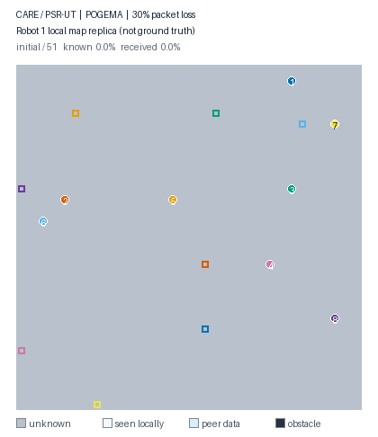

# CARE: Repair Before You Decide

CARE is a compact research implementation for reliable occupancy-map sharing
between multiple robots over lossy links. Its main protocol,
**Commitment-Aware Replica rEpair (CARE)**, keeps an explicit versioned map replica at
each robot, computes an exact minimum-byte scenario certificate, and combines
it with a locally derived route-commitment certificate under positive delay.
The earlier fixed-corridor PSR-UT and rule-based CARE-Lite remain matched
ablations.

The repository also contains three adapted, published reconciliation
baselines: Scuttlebutt-Depth, Dynamo-style Merkle anti-entropy, and partitioned
IBLT set reconciliation. They use the same replicas, planner, lossy link,
delay, packet budgets, and encoded-byte accounting as CARE.

The final method is the `certificate_repair` policy in code and is labeled
`CARE` in generated tables; `deadline_aware_repair` is the CARE-Lite ablation.



The animation shows **Robot 1's evolving local map replica**, not the complete
ground-truth map. It starts fully unknown and is updated by local sensing and
lossy messages received from peers.

| Visual element | Meaning |
| --- | --- |
| Gray cell | Unknown to Robot 1 |
| White cell | Observed locally by Robot 1 |
| Blue cell | Map information received from another robot |
| Dark cell | Known obstacle |
| Colored circle / square | Current robot position / assigned goal |

Robot positions and goals are drawn as a global motion overlay so the paths
remain easy to follow; they are not part of Robot 1's occupancy-map knowledge.
The episode uses eight agents, 30% packet loss, and start-to-goal distances of
14--48 cells, so no robot begins at or immediately beside its goal.

The motivation is simple: a stale map cell is harmful only if it can change a
decision, and a repair is useful only if it arrives before the robot commits.
CARE turns those two observations into an executable communication objective
rather than a fixed retry schedule. The environment and robot motion are provided by
[POGEMA](https://github.com/AIRI-Institute/pogema). All methods use the same
map representation, packet-loss trace, delay model, and byte accounting within
each matched condition. The primary sensor footprint is 5×5. Matched 3×3 and
7×7 extensions expose where partial observability, rather than packet
recovery, becomes the limiting factor. The formal planner-independence check
repeats the matrix with A* and incremental D* Lite. There are no learned
policies or model checkpoints in this repository.

## How it works

At every environment step:

1. each robot converts its local observation into version-stamped sparse map
   updates;
2. updates are sent through a deterministic directed loss/delay channel;
3. each receiver plans on its own local map replica;
4. CARE enumerates a bounded family of sparse occupancy scenarios near the
   receiver's imminent path and replans each scenario on the shared action
   graph;
5. it solves an exact minimum hitting-set problem whose query cells distinguish
   every action-conflicting scenario that can still be repaired in time;
6. under positive delay, the result is combined with an optimistic/pessimistic
   route-commitment certificate and checked against the query--patch round trip;
7. the peer returns only newer stamped cells, after which POGEMA executes the
   selected actions.

For the frozen setting, at most eight candidate cells and two simultaneous
blocked candidates produce at most 37 scenarios and 256 possible query
subsets. The exact scenario-separation theorem, complexity and guarantee
boundary are given in [docs/CARE_ALGORITHM.md](docs/CARE_ALGORITHM.md).

With 100 physically distinct maps, 5×5 sensing, 30% loss, and zero delay,
CARE reaches 0.7362 CSR with A* and 0.7688 with D* Lite, versus
0.6713/0.6900 for One-shot. It uses about 53.25 KB per episode: roughly
5.5 KB above One-shot, 9.5 KB below fixed-corridor PSR-UT, and 101 KB below
Retry-All ARQ. See
[docs/CARE_FINAL_RESULTS.md](docs/CARE_FINAL_RESULTS.md) for all baselines,
loss rates, paired confidence intervals, sensor-range limits and compute cost.

Against published reconciliation algorithms at the same primary point,
Scuttlebutt-Depth is strongest at 0.7125/0.7288 CSR and about 80 KB; optimized
Merkle AE and partitioned IBLT actively repair differences but reach
0.6713/0.6900 and 0.6813/0.6963. CARE remains higher at 53.25 KB. The complete
3×3/5×5/7×7 external-baseline table is in
[docs/EXTERNAL_BASELINES.md](docs/EXTERNAL_BASELINES.md).
The retained paper tables also include CARE-versus-external and
external-versus-One-shot paired confidence intervals for every sensing range.

The implementation separates mapping, communication, planning, and environment
execution so that the protocol can be inspected or replaced independently.

## Wire format and traffic accounting

The simulated link carries real fixed-width binary payloads. Traffic is the
sum of encoded payload lengths for every attempted transmission, including
packets later lost by the channel.

| Payload | Encoded size |
| --- | ---: |
| Cell Delta | 13 bytes |
| Digest Query | `16 + 6N` bytes for N stamped cells |
| Patch | `4 + 13M` bytes for M returned cells |
| ACK | 8 bytes |
| Replica digest | 16 bytes |
| Scuttlebutt version digest | `4 + 5R` bytes for R update origins |
| Merkle probe / match | 20 / 4 bytes |
| Merkle child response | `4 + 16F` bytes for fanout F |
| IBLT sketch | `8 + 23C` bytes for C cells (491 bytes at C=21) |

Receivers validate lengths, versions, reserved bits, bounds, and Delta CRCs,
then apply only updates whose version stamp dominates the local copy. Update
IDs are reconstructed and are not transmitted. See
[docs/WIRE_FORMAT.md](docs/WIRE_FORMAT.md) for the bit layout and decoder
contract.

## Repository layout

```text
cmvr/
  mapping/          Versioned occupancy maps and sparse update encoding
  communication/    Lossy transport, byte budgets, digests, and repair policies
  planning/         Deterministic A*, incremental D* Lite, and planner contract
  env/              POGEMA instances and the closed-loop protocol runner
configs/            Reproducible experiment configurations
scripts/            Experiment, analysis, and visualization entry points
tests/              Unit and integration tests
docs/               Architecture and reproducibility notes
paper/              Manuscript source and generated paper assets
assets/             README media
```

The main execution path is:

```text
EpisodeInstance
    -> PSRClosedLoopRunner
       -> BeliefMap + DeltaEncoder
       -> UnreliableNetwork + ReplicaPolicy
       -> PlanningMapAdapter + selected Planner
    -> PSRResult
```

See [docs/ARCHITECTURE.md](docs/ARCHITECTURE.md) for the responsibility and
data flow of every component.

## Installation

Python 3.10 is recommended.

```bash
python -m venv .venv
. .venv/bin/activate
pip install -r requirements.txt -r requirements-dev.txt
```

Validate the installation:

```bash
PYTHONDONTWRITEBYTECODE=1 python -m pytest -q
```

## Run an experiment

Run any YAML configuration with `run_psr_suite.py`. The output directory must
be empty so results from separate runs cannot be mixed accidentally.

```bash
python scripts/run_psr_suite.py \
  --config configs/care_main_loss_100map.yaml \
  --output-directory /tmp/care-demo \
  --workers 32
```

The runner writes:

```text
/tmp/care-demo/
  instances/        Serialized maps and episode metadata
  results.csv       One row per policy episode
  traces.csv        Per-step replica and repair measurements
  summary.json      Configuration and run metadata
```

To analyze the complete CARE loss/baseline matrix and generate its artifacts:

```bash
python scripts/analyze_care_loss_baselines.py \
  --input-directory /tmp/care-demo \
  --output-directory /tmp/care-analysis
python scripts/make_care_loss_baseline_artifacts.py \
  --analysis-directory /tmp/care-analysis \
  --table-directory /tmp/care-tables \
  --figure-directory /tmp/care-figures
```

Run and analyze the three published reconciliation baselines on 100 matched
maps:

```bash
python scripts/run_psr_suite.py \
  --config configs/care_external_baselines_fov_100map.yaml \
  --output-directory /tmp/care-external --workers 32
python scripts/analyze_external_reconciliation.py \
  --input-directory /tmp/care-external \
  --output-directory /tmp/care-external-analysis
python scripts/make_external_reconciliation_artifacts.py \
  --analysis-directory /tmp/care-external-analysis \
  --table-directory paper/tables
```

Implementation fidelity and the precise adaptations needed for bounded robot
messages are documented in
[docs/EXTERNAL_BASELINES.md](docs/EXTERNAL_BASELINES.md).

Additional commands for topology, scale, delay, and ablation configurations
are documented in [docs/REPRODUCIBILITY.md](docs/REPRODUCIBILITY.md).

## Generate the POGEMA demo

The README animation runs one deterministic dual-certificate CARE episode and replays its
recorded actions in POGEMA using the visualization semantics described above.

```bash
python scripts/make_pogema_demo.py --output assets/pogema_demo.gif
```

The generator is deterministic: the map, link trace, protocol, and action
sequence are fixed by the seeds in the script.
