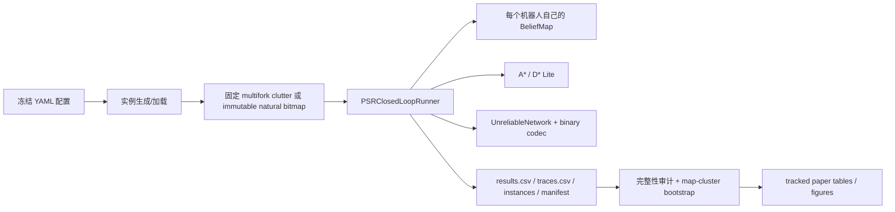

# CARE 代码架构与协作关系

仓库只保留显式占据栅格副本通信的实验链路，不包含 CMVR/Oracle、EPOM
训练或学习型动作策略。A* 与增量 D* Lite 控制运动；CARE 只决定何时、向谁
查询哪些版本化 cell。

## 端到端数据流



同一条件的所有策略共享序列化地图、起终点与确定性逐包丢包 trace，所以差值
按 map 配对。runner 会先保存所有实例，再启动策略 episode；natural selector
因而在任何策略、丢包结果或成功标签产生前冻结。

## 核心模块

| 路径 | 责任 | 协作边界 |
| --- | --- | --- |
| `cmvr/mapping/` | `BeliefMap`、cell stamp、局部观测和稀疏 update | 本地观测与收到的 patch 都通过同一版本优先合并规则。 |
| `cmvr/planning/` | 统一 planner contract、A*、增量 D* Lite | CARE 只消费 receiver 本地副本/路径；不读取真值。 |
| `cmvr/communication/unreliable.py` | 确定性有向丢包、延迟、事件日志和预算 | 每个 delta/query/patch/digest 都以实际 `bytes` 通过该对象。 |
| `cmvr/communication/wire.py` | 固定宽度 codec、CRC、长度和字段校验 | attempted traffic 使用编码后长度，丢失包仍计费。 |
| `cmvr/communication/replica_protocol.py` | CARE、CARE-Lite、task-aware 与 closest-work policy | 构造候选/反事实/证书；只访问 receiver 显式局部状态。 |
| `cmvr/communication/external_reconciliation.py` | Scuttlebutt/Merkle/IBLT primitives | 是占据 cell contract 下的 inspired adaptations，不是完整系统复现。 |
| `cmvr/env/structured_instances.py` | 受控 multifork、topology 与 tiled stress 实例 | background clutter 可独立，受保护的决策结构保持固定。 |
| `cmvr/env/natural_critical.py` | 自然 action-conflict 条件生成器 | 先采 immutable Bernoulli bitmap，再仅按冻结几何谓词选择；记录前后 SHA。 |
| `cmvr/env/psr_runner.py` | 唯一 closed-loop runner | 编排感知、发送、交付、规划、POGEMA 动作和 role-aware metrics。 |
| `cmvr/utils/` | 配置、种子和确定性工具 | 保证串行/并行与重跑一致。 |

## 方法在同一 runner 中的区别

| 策略 | 触发 | 修复范围 |
| --- | --- | --- |
| No Communication | 从不发送 | 无，严格 0 attempted bytes |
| One-shot | 无修复 | 每个新 delta 只发送一次 |
| Retry-All / Path-Weighted ARQ | update 尚未确认 | 缺失 delta；Path-Weighted 只改变优先级 |
| Periodic / Continuous Full | 每 K=4 / K=1 步 | 在同一 data cap 下轮转已知全副本 |
| Mismatch Full | replica digest 不一致 | 已知全副本 chunk |
| PSR-UT | 固定 corridor 中存在 path uncertainty | corridor cell |
| CARE-Lite | 乐观/悲观路径产生及时 action conflict | 手工 influence set |
| Path-Aware Top-K | 路径附近有 UNKNOWN | 不重规划的 path-distance top K |
| Single-Cell | 单 cell blocked 反事实改变动作 | 独立 cell 排序，不构造联合 scenario |
| OCBC-FS（adapt.） | sampled local worlds 有正 safe-progress gain | 正 gain exact-cell arms |
| PGSC（adapt.） | path-weighted proposal 存在 | greedy spatial-coverage exact cells |
| Bernoulli R-D（adapt.） | 局部 Bernoulli distortion 可降低 | 最大 `path weight × q(1-q)` exact cells |
| VoI/byte（adapt.） | 单 cell progress gain/编码 byte 为正 | 独立 counterfactual top K |
| CARE（final） | 有 deadline-feasible action-conflicting scenario pair | 仅 uniform-byte exact minimum hitting set；不附加 route witness |
| CARE-RouteGate（ablation only） | exact certificate 加辅助 route witness | first-UNKNOWN route-slack proxy 可 hard-suppress witness |
| CARE-NoCommitGate（ablation only） | exact certificate 加辅助 route witness | 始终保留 raw route witness，不做上述 hard gate |

Final CARE 的唯一 deadline 规则直接过滤来不及修复的 scenario conflict。
两种 auxiliary route-witness policy 都不是 final algorithm。严格 ablation
表明 hard-gated witness 在 delay=2 显著降低 seeker success；完整结果见
`docs/COMMITMENT_GATE_ABLATION.md`。

## 实例和指标契约

受控八机器人 multifork 由四个 observer 和四个 decision-critical seeker
组成。observer 均在一步后完成，因此旧 overall CSR 有 0.5 结构性下限。
新 `PSRResult` 和 CSV 明确保存：

- 直接序列化的 `observer_ids`、`seeker_ids`、`critical_pairs`、
  `completion_steps`、`completed_mask`；
- `observer_success_rate`、`seeker_success_rate`、
  `critical_pair_success_rate`、`all_seekers_success`；
- 每个 agent 的 completion step，以及 uncensored/censored seeker completion；
- certificate、commitment gate、closest-work planning/sample diagnostics；
- attempted/delivered bytes、path/replica error 与 CPU timing。

论文主 endpoint 是 seeker CSR；overall CSR 只做 backward-compatible
diagnostic。旧受控结果若用 `(2×overall)-1` 精确反推 seeker 值，必须标注
为 derived，不能伪装成旧 CSV 的直接字段。

## 编码、解码和计费

Cell Delta 13 B，Digest Query `16+6N` B，Patch `4+13M` B，ACK 8 B，
Replica Digest 16 B。接收端校验 wire version、长度、reserved bits、边界和
Delta CRC，再依据 `(version, observed_at, source_id, state)` 合并。network
不传 Python 对象；尝试发送但丢失的 payload 仍计入 attempted traffic。
详细字段见 [`WIRE_FORMAT.md`](WIRE_FORMAT.md)。

## 执行与产物

| 脚本 | 输入/作用 | 主要输出 |
| --- | --- | --- |
| `run_psr_suite.py` | 一个 frozen YAML；先生成并保存实例，再并行策略 episode | `instances/`、`results.csv`、`traces.csv`、`summary.json`，natural 时另有 accepted manifest |
| `run_care_extension_matrix.py` | 旧 density/topology/tiled scale/q-cap-cadence stress | study manifest 与 raw outputs |
| `run_care_natural_scale.py` | 4/8/16/32 非 tiled natural matrices | 每个 scale 独立目录与 scale manifest |
| `analyze_care_loss_baselines.py` | 主矩阵 role-aware mean/SD/CI 和 paired effects | audit CSV/JSON |
| `analyze_care_closest_work.py` | closest-work 三 FOV matrix | role-aware summary、paired effects、compute counts |
| `analyze_care_commitment_gate.py` | same-certificate hard-gate ablation | negative control、non-inferiority 和 traffic audit |
| `analyze_care_natural_validity.py` | natural primary + non-tiled scale | immutable-layout audit、role-aware summaries |
| `make_*_artifacts.py` | audited analysis | `paper/tables/` 与 `paper/figures/` 的派生投稿产物 |

`outputs/` 的 raw CSV、trace 和实例由 `.gitignore` 排除。GitHub 保存代码、
configs、分析脚本、五份完整 accepted-layout manifest 与派生表/图。natural
analyzer 会重算每个 serialized NPZ 的 SHA、从 raw seed bit-exact 重建 bitmap，
并交叉检查 results/instances/manifest。69,800 episode executions 已全部完成；
其中包含跨矩阵重复 anchor，不能当作 69,800 个独立样本。所有复现命令见
[`REPRODUCIBILITY.md`](REPRODUCIBILITY.md)。

## 测试

```bash
PYTHONDONTWRITEBYTECODE=1 python -m pytest -q
```

测试覆盖 planner 一致性、stamp 合并、codec/CRC、loss/delay、CARE 证书、
closest-work 控制、gate negative control 字段、natural bitmap immutability、
role metrics、100-map 唯一性以及串行/并行一致性。
