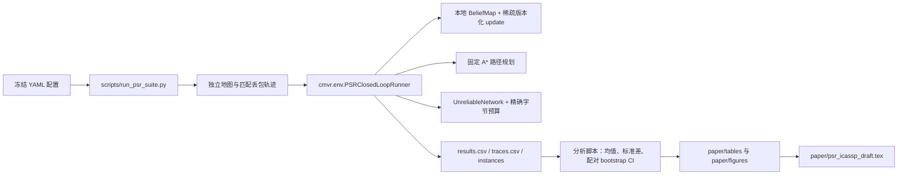

# PSR-UT 代码架构与协作关系

本仓库只保留论文中使用的 PSR-UT 显式地图副本实验链路。它不包含
CMVR/Oracle、EPOM 训练、学习型通信策略或外部 MARL 方法的复现。

## 端到端数据流



每张地图有一个 `layout_seed` 和一个匹配的 `network_seed`。同一 map
下的所有策略共享地图、起终点和逐包丢失抽样键；因此策略差值可按 map
配对，而不是把独立的 episode 均值误当成配对证据。

## 核心包

| 路径 | 责任 | 与其他模块的协作 |
| --- | --- | --- |
| `cmvr/mapping/` | `BeliefMap`、cell stamp、局部观测编码、增量更新 | 环境将观测写入本地副本；网络交付的版本化 update 也在这里合并。 |
| `cmvr/planning/` | 确定性 A* 和路径合法性 | runner 在每步对每个 receiver-local map 规划；PSR-UT 用乐观/悲观两个规划结果判断下一动作是否不同。 |
| `cmvr/communication/unreliable.py` | 有向、固定 seed 的丢包/延迟信道与 event log | 所有 delta、digest、ACK 和 repair 都经过同一对象；输出按 data/control/repair 分项计费。 |
| `cmvr/communication/replica_protocol.py` | policy enum、配置、digest、corridor 和 patch payload | 定义 wire-level 对象，不访问真值地图或 planner。 |
| `cmvr/communication/wire.py` | 固定宽度二进制 codec、CRC、字段边界和精确长度 | runner 在发送前编码、到达后解码；network 只接受 `bytes` 且强制 `len(payload) == byte_size`。 |
| `cmvr/env/instance.py`、`structured_instances.py` | 随机与决策关键拓扑实例 | 为所有配对策略生成同一个可指纹化实例。 |
| `cmvr/env/psr_runner.py` | 唯一的 closed-loop 执行器 | 编排观测、A*、通信、交付、修复与 POGEMA 动作，并生成 episode 级与 step 级指标。 |
| `cmvr/utils/` | 配置和随机种子 | 保证跨进程、跨重跑的一致性。 |

## 方法在同一 runner 中的差别

所有策略共享地图表示、A*、每 sender 每步字节上限、链路丢失/延迟和
instance/loss trace。差别只在“何时修复”与“修复哪里”。

| 策略 | 何时修复 | 修复范围 |
| --- | --- | --- |
| One-shot | 从不 | 无；普通 delta 只尝试一次 |
| Retry-All / Path-Weighted | 每次需要重传时 | 缺失 delta |
| Periodic Full (K=4) | 每四步 | 已知全副本的公平轮转 chunk |
| Mismatch Full | replica digest 不一致时 | 全副本 chunk |
| PSR-UT | 本地乐观/悲观下一动作不同且在 corridor 内 | 接收端当前路径 corridor |

Periodic Full 在非同步步发送普通 one-shot delta；同步步用同一 data cap
优先发送完整已知副本的一个 chunk。chunk 同时轮转 cell 和 receiver，避免
小预算下总是只发送给低编号机器人或只发送首批 cell。

## 编码、解码与计费

应用层实际发送固定宽度字节串，而不是直接在 network 中传递 Python
对象。Cell Delta 为 13 B，Digest Query 为 `16+6N` B，Patch 为
`4+13M` B，ACK 为 8 B，Replica Digest 为 16 B。发送预算使用编码后的
`len(payload)`，丢失包同样计入 attempted traffic。接收端先验证 wire
version、长度、保留位、字段边界与 Delta CRC，再重建 update 并按
`(version, observed_at, source_id, state)` 合并。完整字段与位布局见
[`docs/WIRE_FORMAT.md`](WIRE_FORMAT.md)。

## 脚本与结果契约

| 脚本 | 输入 | 输出 |
| --- | --- | --- |
| `run_psr_suite.py` | 一个 YAML 或等价 config | `instances/`、`results.csv`、`traces.csv`、`summary.json` |
| `run_psr_100map_matrix.py` | 内置正式 13-study 设计 | formal matrix manifest 与各 study 输出 |
| `run_psr_scale_100map.py` | 内置 4/8/16/32-agent 设计 | scale manifest 与各 study 输出 |
| `analyze_psr_100map_matrix.py` | formal matrix | 每条件均值、样本标准差、bootstrap CI、PSR-UT 配对差异 |
| `analyze_psr_external_baselines.py` | 一个或多个 30%-loss、零延迟的匹配 `results.csv` | 主 baseline 汇总与 PSR-UT 配对比较；Periodic Full 与正式 loss sweep 在此合并 |
| `analyze_psr_full_method_ablations.py` | formal 和 action-ablation 根目录 | 全方法对单组件 ablation 的配对差异 |
| `analyze_psr_topology_variants.py` | 三个 topology 根目录 | topology extension 汇总 |
| `make_psr_ut_paper_artifacts.py` | formal summary，及可选 periodic summary | 论文主表、Pareto 图、loss 曲线和 two-gate 示意图 |

所有 runner 拒绝覆盖非空输出目录。这是为了防止新运行静默混入已冻结的
100-map 证据。完整命令见 `docs/REPRODUCIBILITY.md`。

## 测试边界

`tests/` 覆盖 A*、实例确定性、地图 stamp 合并、丢包链路、PSR runner、
周期反熵的预算/轮转、并行与串行的结果一致性，以及分析脚本的 complete
matched-matrix 检查。运行：

```bash
PYTHONDONTWRITEBYTECODE=1 python -m pytest -q
```
